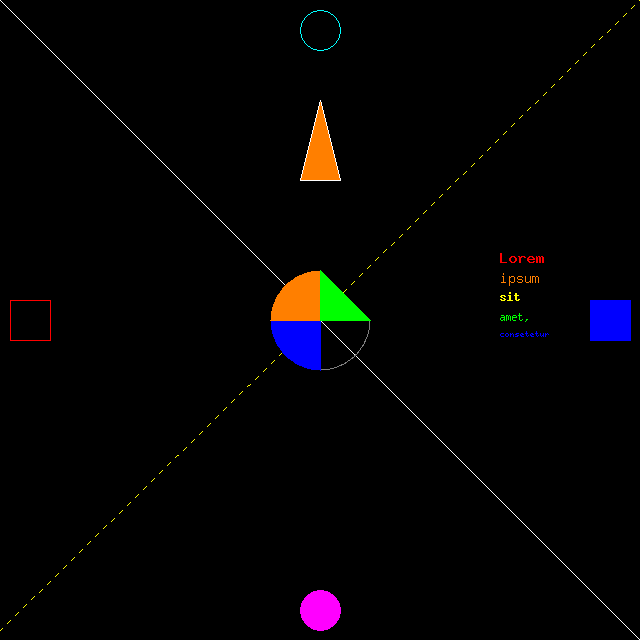
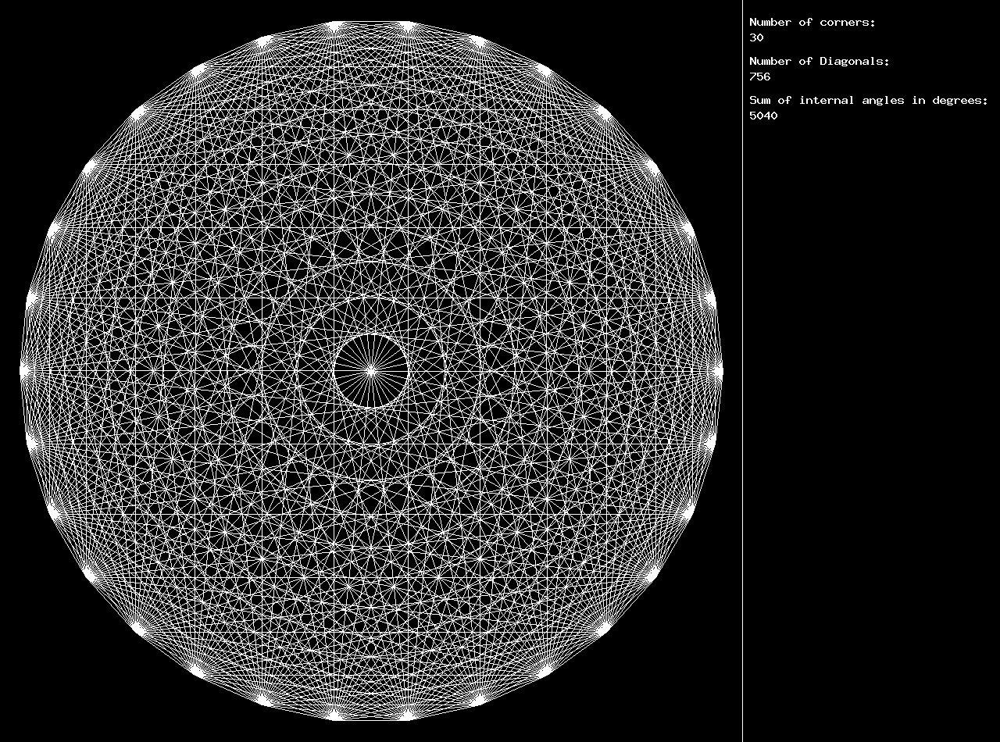
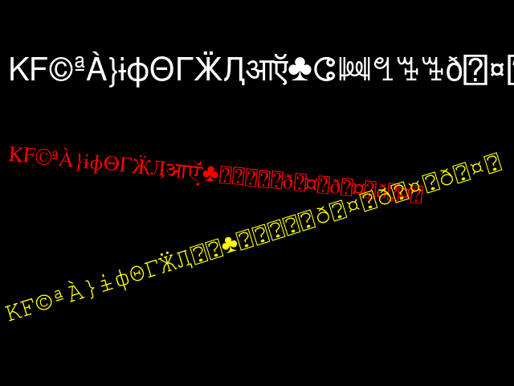
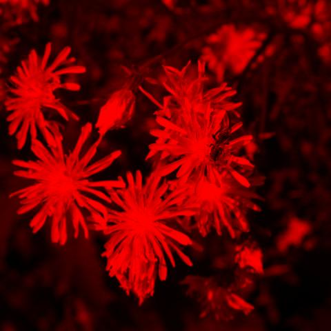
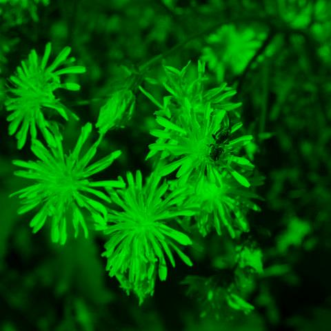
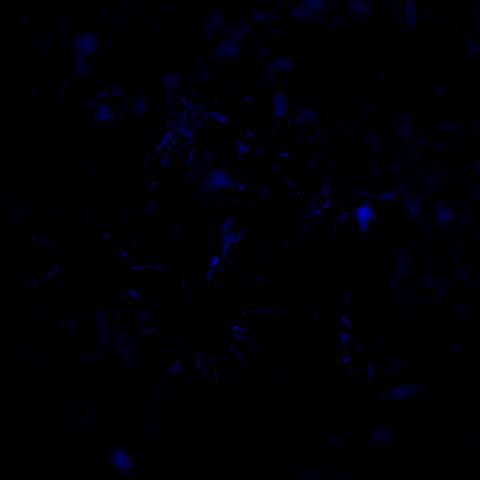
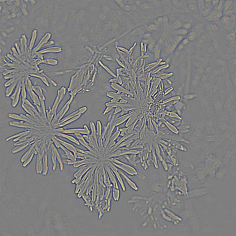

# fortran-gdlib
Fortran binding for the GD graphics library [https://libgd.github.io/](https://libgd.github.io/).

## Table of Contents

* [Requirements](#requirements)
* [Compiling](#compiling)
* [Running the Tests](#running-the-tests)
* [Using the Library](#using-the-library)
* [Current status and Aims](#current-status-and-aims)
* [Image Gallery](#image-gallery)
  - [Primitive Drawing Operations](#primitive-drawing-operations)
  - [Font Handling](#font-handling)
  - [Image Processing](#image-processing)

<a name="requirements"></a>
## Requirements
* Fortran-2008 compatible Fortran compiler (tested with gfortran 11)
* libGD and its dependencies

<a name="compiling"></a>
## Compiling 
Edit the ```Makefile``` such that ist fits both your Fortran environment and your installation of the GD Library.
The library is then created (along with an example applications) by invoking the ```make``` command.

<a name="running-the-tests"></a>
## Running the tests
Change to the ```tests``` subdirectory and run the ```run_tests.sh ``` script using the system shell (For Windows there is also a ```unn_tests.bat``` script). The output files can 
then be found in the ```outpics``` subdirectory of tests.

<a name="using-the-library"></a>
## Using the Library
The library is a thiny wrapper around the GD C library, so that the documentation of the C library can actually be used 
for the wrapper, too. 
A compilation of rescources concerning interfacing between C and Fortran can be found in the documentation of GTK Fortran
by Vincent Magnin and others: [https://github.com/vmagnin/gtk-fortran/wiki/Fortran-interoperability-with-C](https://github.com/vmagnin/gtk-fortran/wiki/Fortran-interoperability-with-C).

I think the most important points one has to get used to are:

* Use the ```iso_c_binding``` intrinsic module and the data typed defined there for C compatibility.

* Add the ```c_null_char``` at the end every string.

* Use a C type file handling using the wrapper functions ```gd_fopen``` for the ```fopen``` function of the C library
and ```gd_fclose``` for the ```fclose``` function of the C standard library. So unfortunately the
binding does not integrate well in the Fortran way of handling files (and there is no easy way to
implement this in a portable way).

To use the library for own projects, you have to copy the library files (In the case of Unix-like systems ```fortran_libgd.a``` ist the static and ```fortran_libgd.so``` the dynamically
library binary) and the module file (```fortran_libgd.mod``` in the case of gfortran, the name may vary among different compilers) to locations in the file system where they are
found by the compiler. In the case of the shared library, its position has to be included in the corresponding search path.

*Note:* The library files are not necessarily compatible among diffent compilers or even different versions of the same compilers.

<a name="current-status-and-aims"></a>
## Current status and aims

Currently it is in an early state and supports only 
a subset of the functions provides by the GD library.
Still, I think that the most relevant functionality is already there.
My plan is to gradually add more functions, but it is unlikely that the wrapper will ever
cover the complete functionality of the GD librrary.

If you miss sopme functionality just drop me a message or -- even better -- add that functionality and and fill a pull request.

The current implementation status is (✅: implemented und tested, ❓: implemented, but not tested, ✘: not implemented; if a function
is not mentioned here, it is likely not supported)

* gdAlphaBlend (❓)
* gd_fclose (✅) 
* gdClearErrorMethod (✘) 
* gdFontCacheShutdown (❓)
* gdFontGetGiant (✅)
* gdFontGetLarge (✅)
* gdFontGetMediumBold (✅)
* gdFontGetSmall (✅)
* gdFontGetTiny (✅)
* gd_fopen (✅)
* gdImageAAblend (✘)
* gdImageAlphaBlending (❓)
* gdImageArc (✅)
* gdImageAlpha (❓)
* gdImageBlue (✅)
* gdImageBoundsSave (✘)
* gdImageBrightness (❓)
* gdImageClone (❓)
* gdImageChar (❓)
* gdImageCharUp (❓)
* gdImageColor (❓)
* gdImageColorClosest (✘)
* gdImageColorClosestAlpha (✘)
* gdImageColorClosetExact (✘)
* gdImageColorClosetExactAlpha (✘)
* gdImageColorAllocate (✅)
* gdImageColorAllocateAlpha (❓)
* gdImageColorDeallocate (✘)
* gdImageColorPaletteCopy (✘)
* gdImageColorReplace (❓)
* gdImageColorReplaceArray (✘)
* gdImageColorReplaceCallback (✘)
* gdImageColorReplaceThreshold (✘)
* gdImageColorResolve (✘)
* gdImageColorResolveAlpha (✘)
* gdImageColorsTotal (❓)
* gdImageColorTransparent (✘)
* gdImageConvolution (✘)
* gdImageCompare (❓)
* gdImageContrast (❓)
* gdImageCopy (❓)
* gdImageCopyGaussianBlurred (❓)
* gdImageCopyMerge (❓)
* gdImageCopyMergeGrey (❓)
* gdImageCopyResampled (❓)
* gdImageCopyResized (❓)
* gdImageCopyRotated (❓)
* gdImageCreate (✅)
* gdImageCreateFromFile (✅)
* gdImageCreatePaletteFromTrueColor (✅)
* gdImageCreateTrueColor (✅)
* gdImageCrop (✅)
* gdImageCropAuto (✅)
* gdImageCropThreshold (✅)
* gdImageDashedLine (✅)
* gdImageDestroy (✅)
* gdImageEdgeDetectQuick (✅)
* gdImageEllipse (✅)
* gdImageEmboss (❓)
* gdImageFile (❓)
* gdImageFill (✅)
* gdImageFilledArc (✅)
* gdImageFilledEllipse (✅)
* gdImageFilledPolygon (❓)
* gdImageFilledRectangle (✅)
* gdImageFillToBorder (✘)
* gdImageFlipBoth (❓)
* gdImageFlipHorizontal (❓)
* gdImageFlipVertical (❓)
* gdFontCacheShutdown (❓)
* gdImageGaussianBlur (❓)
* gdImageGetClip (❓)
* gdImageGetInterlaced (❓)
* gsImageGetInterpolationMethod (✘)
* gdImageGetPixel (❓)
* gdImageGetTrueColorPixel (✅)
* gdImageGif (✅)
* gdImageGifAnimAdd (✅)
* gdImageGifAnimAddCtx (✘)
* gdImageGifAnimAddPtr (✅) 
* gdImageGifAnimCtx (✘)
* gdImageGifAnimBegin (✅)
* gdImageGifAnimBeginCtx (✘)
* gdImageGifAnimBeginPtr (✅)
* gdImageGifCtx (✘)
* gdImageGifPtr (✅)
* gdImageGrayScale (❓)
* gdImageGreen (✅)
* gdImageInterlace (❓)
* gdImageJpeg (✅)
* gdImageLine (✅)
* gdImageMeanRemoval (❓)
* gdImageNegate (❓)
* gdImageNeuQuant (❓)
* gdImageOpenPolygont (❓)
* gdImagePalettePixel (❓)
* gdImagePaletteToTrueColorp (✘)
* gdImagePixelate (❓)
* gdImagePng (✅)
* gdImagePolygon (❓)
* gdImageRectangle (✅)
* gdImageRed (✅)
* gdImageResolutionX (✅)
* gdImageResolutionY (✅)
* gdImageRotateInterpolated (✅)
* gdImageScatter (❓)
* gdImageScatterColor (❓)
* gdImageSelectiveBlur (❓)
* gdImageSetAntiAliased (❓)
* gdImageSetAntiAliasedDontBlend (❓)
* gdImageSetBrush (❓)
* gdImageSetClip (✘)
* gdImageSetInterpolationMethod (❓)
* gdImageSetResolution (✘)
* gdImageSetStyle (❓)
* gdImageSetThickness (❓)
* gdImageSetTile (❓)
* gdImageSmooth (❓)
* gdImageString (✅)
* gdImageStringUp (✘) 
* gdImageString16 (✘)
* gdImageStringUp16 (✘)
* gdImageStringFT (✅)
* gdImageSX (✅)
* gdImageSY (✅)
* gdImageTrueColor (❓)
* gdImageTrueColorPixel (❓)
* gdImageTrueColorToPalette (❓)
* gdImageTrueColorToPaletteSetMethod (❓)
* gdImageTrueColorToPaletteSetQuality (❓)
* gdLayerMultiply (❓)
* gdLayerOverlay (❓)
* gdMinorVersion (✅)
* gdMajorVersion (✅)
* getPixelRgbInterpolated (✘)
* gdReleaseVersion (✅)
* gdSetErrorMethod (✘)
* gdSupportsFileType (❓)
* gdTransformAffineBoundingBox (✘)
* gdTransformAffineCopy (✘)
* gdTransformAffineGetImage (✘)
* gdTrueColorGetAlpha (❓)
* gdTrueColorGetBlue (❓)
* gdTrueColorGetGreen (❓)
* gdTrueColorGetRed (❓) 

<a name="image-gallery"></a>
## Image Gallery

### Primitive Drawing Operations
Demonstration of primitive Drawing operations (line arcs, filling areas ect..)

<a name="primitive-drawing-operations"></a>


Regular polygon wirth 30 corners and diagonals.


<a name="font-handling"></a>
### Font Handling
Demonstration of the True-Type Font handling capabilities of the Library (the rectangles with quotation marks are indicators that a character is not provided by the current font and not a bug of the library..



<a name="image-processing"></a>
### Image Processing
Sequence of images of a flower where the first is the unedited one,
the next ones arfe the red, green and blue color channels of that image and 
the last one uses an edge-detection function built-in in GD lib








